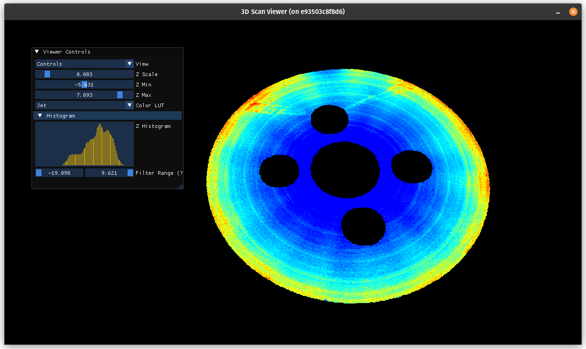

# 3D Scan Viewer


## Overview

The 3D Scan Viewer is a graphical application designed to visualize 3D point cloud data. It supports loading and displaying point cloud data from TIFF files, applying Fourier filters, and interacting with the 3D view using mouse controls. The application uses OpenGL for rendering and ImGui for the graphical user interface.

## Features

- **Browse and Load TIFF Files**: Load 3D point cloud data from TIFF files via a graphical user interface.
- **Interactive 3D View**: Rotate, zoom, and pan the 3D view using mouse controls.
- **Adjustable Z Scaling**: Modify the Z-axis scaling to enhance the visualization.
- **Color LUTs**: Choose from multiple color lookup tables (Jet, Viridis, Plasma) for visualizing the data.
- **Bandpass Fourier Filter**: Apply a bandpass Fourier filter to the data for frequency decomposition.

## Controls

- **Rotate**: Left-click and drag to rotate the view.
- **Zoom**: Scroll to zoom in and out.
- **Pan**: Shift + left-click and drag to pan the view.

## Dependencies

- [GLFW](https://www.glfw.org/)
- [GLEW](http://glew.sourceforge.net/)
- [GLM](https://github.com/g-truc/glm)
- [ImGui](https://github.com/ocornut/imgui)
- [libtiff](http://www.libtiff.org/)
- [FFTW](http://www.fftw.org/)

## Building and Running

### Prerequisites

Ensure you have the following libraries installed on your system:

- GLFW
- GLEW
- GLM
- ImGui
- libtiff
- FFTW

### Building

1. Clone the repository:
    ```sh
    git clone https://github.com/yourusername/3DScanViewer.git
    cd 3DScanViewer
    ```

2. Create a build directory and navigate to it:
    ```sh
    mkdir build
    cd build
    ```

3. Configure the project using CMake:
    ```sh
    cmake ..
    ```

4. Build the project:
    ```sh
    make
    ```

### Running

After building the project, you can run the executable:

```sh
./3DScanViewer
```

### Usage

1. Loading Data:

   * Use the "Data" panel to input the folder path containing TIFF files.
   * Click "Browse Folder" to load the TIFF files from the specified folder.
   * Click on a TIFF file button to load and visualize the data.
   * Alternatively, click "Load Default Data" to load sample data.

2. Adjusting Visualization:

   * Use the "Controls" panel to adjust Z scaling, Z min/max values, and select a color LUT.
   * Apply a bandpass Fourier filter by adjusting the filter parameters and clicking "Apply Filter".

3. About:

   * The "About" panel provides information about the application and its features.

### License
This project is licensed under the MIT License. See the LICENSE file for details.

### Acknowledgements
GLFW
GLEW
GLM
ImGui
libtiff
FFTW

### Contact
For any questions or issues, please contact yourname@domain.com.